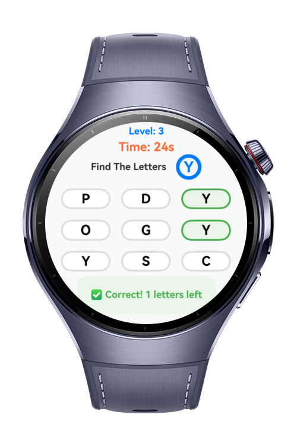
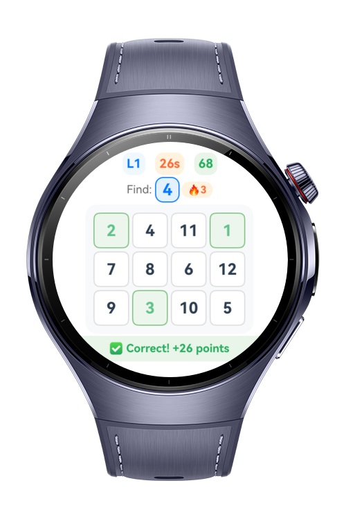
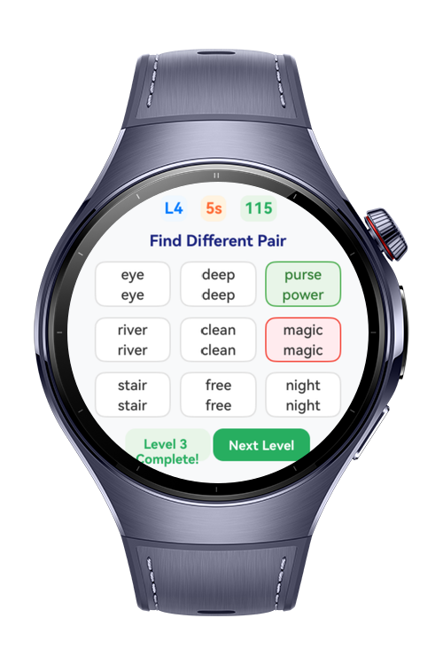

> **Note:** To access all shared projects, get information about environment setup, and view other guides, please visit [Explore-In-HMOS-Wearable Index](https://github.com/Explore-In-HMOS-Wearable/hmos-index).

# Fast Reading Exercises

**Speed Reading App** is designed to improve users’ reading speed, attention, and visual perception with a set of interactive exercises. Each feature targets a specific skill crucial for efficient and effective reading. The application offers a practical way for users to enhance their reading performance in a gamified environment.

# Preview

<div>
  
  
  
  
</div>

# Use Cases

* To enhance reading speed and attention with daily practice.
* To perform visual and cognitive exercises for students and professionals.
* To be used as an effective tool for users preparing for exams that require fast reading and high concentration.
* To improve visual scanning speed and selective attention with the **"Find the Letter"** feature.
* To learn to process words and sentences faster using the **"Reading Accelerator"** module.
* To train peripheral vision, visual attention, and working memory with the **"Schulte Table"** exercise.
* To sharpen visual discrimination skills and attention to detail with the **"Similar Words"** game.

# Tech Stack

* **Languages:** ArkTS, ArkUI
* **Frameworks:** HarmonyOS SDK 5.1.0(18)
* **Tools:** DevEco Studio 5.1.0.842
* **Libraries:** @kit.ArkUI

# Directory Structure

```
modules
│   ├── commons_library/
│   │   └── utils/
│   │       ├── Logger.ets
│   │       └── WindowUtil.ets
│   ├── entry/
│   │   ├── entryability/
│   │   │   └── EntryAbility.ets
│   │   ├── entrybackupability/
│   │   │   └── EntryBackupAbility.ets
│   │   └── pages/
│   │       └── NavigationRouter.ets
│   ├── feature_findtheletter/
│   │   ├── LetterCell.ets
│   │   ├── LetterFindingLogic.ets
│   │   └── LetterFindingPage.ets
│   ├── feature_landing/
│   │   └── LandingPage.ets
│   ├── feature_readingaccelerator/
│   │   ├── ReadingAccelerator.ets
│   │   └── ReadingAcceleratorLogic.ets
│   ├── feature_schultetable/
│   │   ├── SchulteTableLogic.ets
│   │   └── SchulteTablePage.ets
│   ├── feature_similarwords/
│   │   ├── SimilarWordsLogic.ets
│   │   └── SimilarWordsPage.ets
│   └── feature_splash/
│       └── SplashPage.ets
```
# Constraints and Restrictions

## Supported Device 

* Huawei Watch 5

# LICENSE

Fast Reading Exercises is distributed under the terms of the MIT License.
See the [LICENSE](LICENSE) for more information.